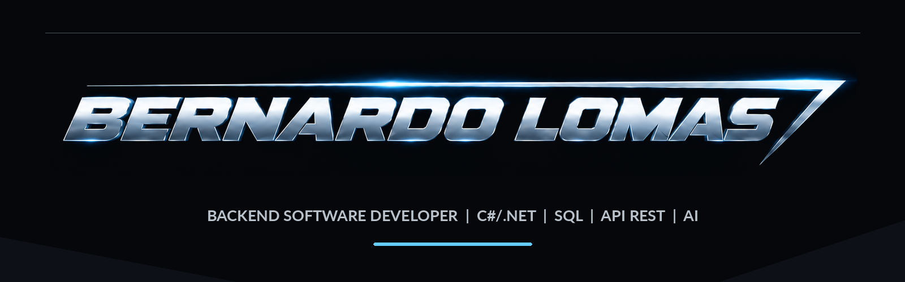

  <a href="https://bernardolomasdev.com.br"><b>PORTFOLIO</b></a>
  &nbsp;&nbsp;•&nbsp;&nbsp;
  <a href="https://www.linkedin.com/in/bernardolomas/"><b>LINKEDIN</b></a>
  &nbsp;&nbsp;•&nbsp;&nbsp;
  <a href="https://github.com/BernardoLomas"><b>GITHUB</b></a>

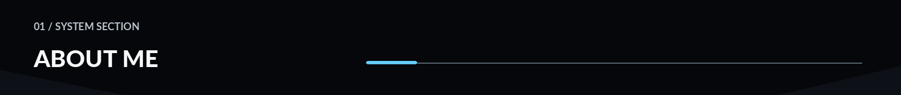

I am a Backend Software Developer and an Information Systems student at PUC Minas, with professional experience in SAP/ABAP development and a strong focus on C#/.NET, REST APIs, SQL, testing, and software engineering.

In my professional experience, I work with enterprise systems, object-oriented programming, REST integrations, debugging, unit testing, legacy code analysis, and technical documentation. I have also worked with OAuth authentication, HTTP flows, ABAP Unit, test doubles, and dependency injection, building a practical foundation in software development, integrations, and problem solving.

Alongside my professional work, I develop personal C#/.NET projects to deepen my backend experience. One of them is the Purchase Order API, a REST API for managing suppliers, products, and purchase orders, where I apply domain modeling, layered architecture, business rules, SQL, xUnit, dependency injection, Clean Code, and SOLID principles.

Another key project in my journey is JARVIS, a development and automation assistant designed to centralize tools, workflows, and AI capabilities in a custom interface. The project was born from my interest in reducing repetitive tasks, improving development workflows, and exploring how AI and automation can practically enhance developer productivity.

I have a strong interest in AI applied to software development, especially as a tool for automation, productivity, learning, and building solutions, always supported by solid software engineering fundamentals.

In addition to my technical background, I have advanced English proficiency and experience as an English teacher, which has strengthened my communication, teaching skills, and ability to explain technical concepts clearly and work in international environments.

My goal is to continue growing as a Backend Software Developer, working with C#/.NET, APIs, databases, testing, architecture, automation, and AI applied to software development, in environments that encourage strong technical collaboration and continuous learning.

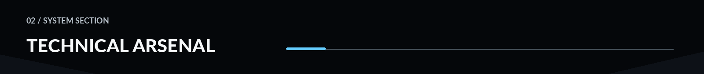

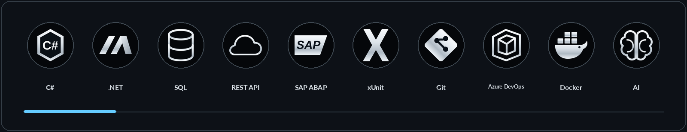

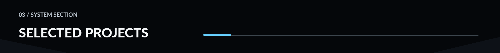

[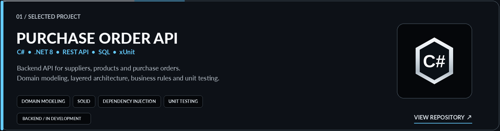](https://github.com/BernardoLomas/api-orders)

[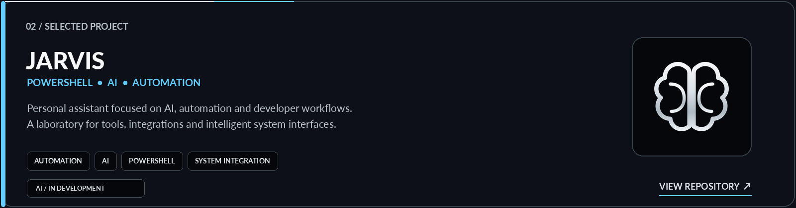](https://github.com/BernardoLomas/jarvis)

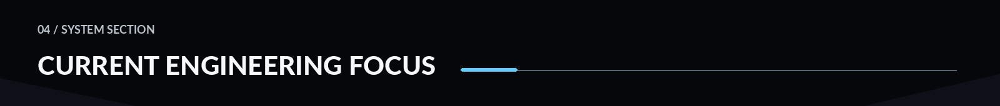

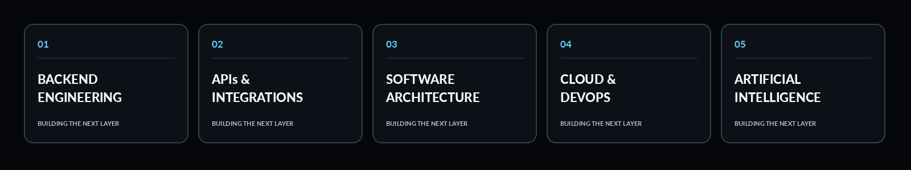

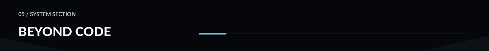

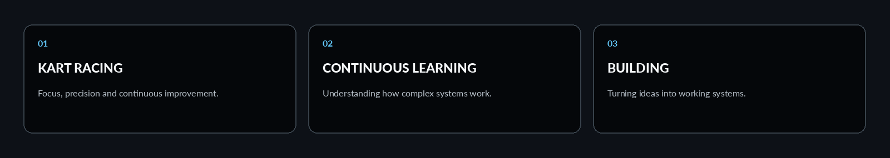

Outside software, I enjoy **kart racing**, exploring new technologies and learning how complex systems work. The same things that attract me to engineering — precision, iteration and continuous improvement — are a big part of what I enjoy beyond code.

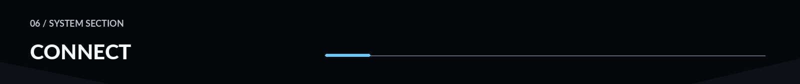

  <a href="https://bernardolomasdev.com.br"><b>PORTFOLIO</b></a>
  &nbsp;&nbsp;&nbsp;/&nbsp;&nbsp;&nbsp;
  <a href="https://www.linkedin.com/in/bernardolomas/"><b>LINKEDIN</b></a>
  &nbsp;&nbsp;&nbsp;/&nbsp;&nbsp;&nbsp;
  <a href="https://github.com/BernardoLomas"><b>GITHUB</b></a>

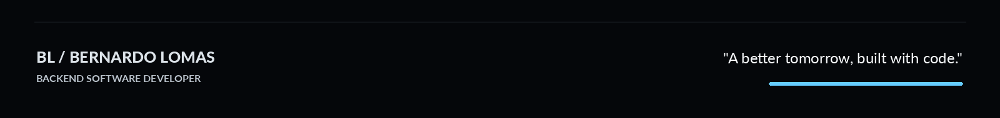
