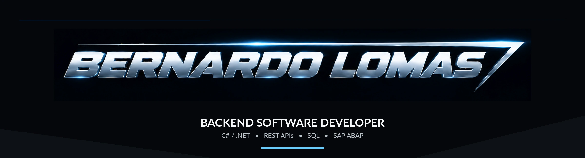
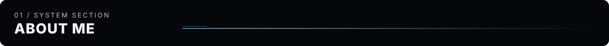
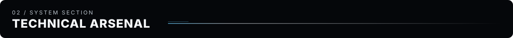
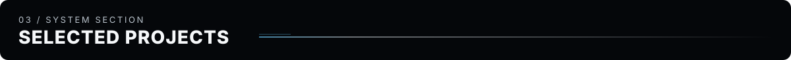
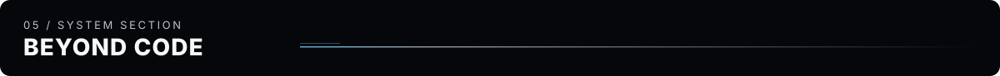
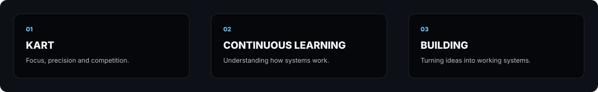
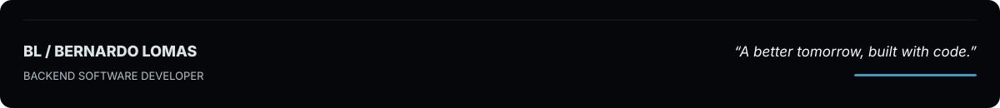

[Portfolio](https://bernardolomasdev.com.br) ·
[LinkedIn](https://www.linkedin.com/in/bernardolomas/) ·
[GitHub](https://github.com/BernardoLomas)

Backend developer focused on **scalable solutions, integrations and
automation**. I currently work with **SAP ABAP at SEIDOR** while
expanding my backend engineering experience through projects with **C#
and .NET**.

I am an **Information Systems student at PUC Minas** and I enjoy
understanding how systems work behind the scenes, solving complex
problems and turning ideas into reliable software.

My current goal is to keep evolving toward backend engineering,
combining strong software fundamentals with APIs, architecture, cloud,
DevOps and AI.

Outside software, I enjoy **kart racing**, exploring new technologies
and learning how complex systems work. The same things that attract me
to engineering — precision, iteration and continuous improvement — are a
big part of what I enjoy beyond code.

**[PORTFOLIO](https://bernardolomasdev.com.br)** ·
**[LINKEDIN](https://www.linkedin.com/in/bernardolomas/)** ·
**[GITHUB](https://github.com/BernardoLomas)**

